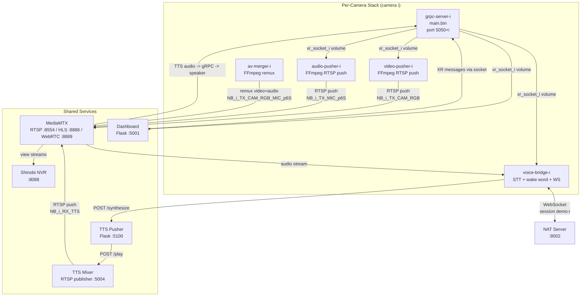

# XR Runtime

Manages VITURE XR glasses hardware, RTSP video/audio streaming, speech-to-text, text-to-speech, and a web dashboard. Connects to any agent server (NAT or third-party) via a standard WebSocket API.

This module has **no agent logic** -- it is purely infrastructure. The intelligence lives in the NAT server (or whatever agent you point it at).

---

## Per-Camera Service Stack

Each connected pair of glasses gets its own set of 5 Docker containers, plus shared services.



---

## Data Flow

### Inbound (glasses to agent)

```
Glasses (Android App)
  -> gRPC (port 5050+i, H.264 video + PCM audio)
  -> Unix domain socket (/tmp/xr_service.sock via Docker volume)
  -> video-pusher (FFmpeg -> RTSP push to MediaMTX: NB_XXXX_TX_CAM_RGB)
  -> audio-pusher (FFmpeg -> RTSP push to MediaMTX: NB_XXXX_TX_MIC_p6S)
  -> av-merger (pulls both RTSP streams, remuxes to: NB_XXXX_TX_CAM_RGB_MIC_p6S)
  -> voice-bridge (pulls audio from MediaMTX, decodes via FFmpeg)
  -> STT service (gRPC or HTTP, external)
  -> Wake word filter (detects "stella" / "hey stella")
  -> WebSocket to NAT server (user_message)
```

### Outbound (agent to glasses)

```
NAT server
  -> WebSocket to voice-bridge (agent_response with tts: true)
  -> voice-bridge POSTs to TTS Pusher (/synthesize)
  -> TTS Pusher calls external TTS model, gets WAV
  -> TTS Pusher POSTs WAV to TTS Mixer (/play?index=N)
  -> TTS Mixer encodes to AAC, pushes to MediaMTX (NB_XXXX_RX_TTS)
  -> gRPC server reads MediaMTX stream, sends to glasses speaker

NAT server
  -> WebSocket to voice-bridge (display_update)
  -> voice-bridge POSTs to Dashboard (/api/send_message)
  -> Dashboard sends via XR socket to gRPC server
  -> gRPC server sends to glasses display
```

---

## Shared Services

| Service | Port | Description |
|---------|------|-------------|
| **MediaMTX** | 8554 (RTSP), 8888 (HLS), 8889 (WebRTC), 9997 (API) | Central RTSP relay. All video/audio streams flow through here. Optionally relays to NAT-side MediaMTX (Mode 3). |
| **Dashboard** | 5001 | Flask web UI for message sending, audio upload, TTS, agent chat, frame capture. Mounts XR socket volume for direct glass communication. |
| **TTS Pusher** | 5100 | Flask server that synthesizes text via pluggable TTS providers (Riva gRPC, Qwen HTTP, VibeVoice). Pushes WAV output to TTS Mixer. |
| **TTS Mixer** | 5004 | Maintains persistent RTSP audio streams per camera. Accepts WAV via HTTP, encodes to AAC, pushes to MediaMTX. Writes silence to keep streams alive. |
| **Shinobi NVR** | 8088 | Network video recorder for viewing and recording camera streams. Optional (gated by config). |
| **MySQL** | 9906 | Database backend for Shinobi. |

---

## IPC: Unix Domain Sockets

The gRPC server (`main.bin`) and Python services communicate through a shared Docker volume (`xr_socket_i`) containing a Unix domain socket at `/tmp/xr_service.sock`.

The `xr_service_library` Python package (installed from `.whl`) provides `XRServiceConnection` with methods:
- `connect()` -- establish connection
- `get_latest_frame()` -- returns video frame as numpy array
- `get_incoming_audio_samples()` -- returns audio samples
- `send_message(Message)` -- send typed messages to glasses display
- `schedule_audio_transmission(AudioSample)` -- send audio to glasses speaker

---

## Session Lifecycle

A **session** is the WebSocket connection between the voice bridge and the NAT server. Closing the WebSocket connection resets the session -- the NAT server treats a new connection as a fresh conversation.

### Glasses Connect

When XR glasses connect to the gRPC server and audio starts flowing, the voice bridge:

1. Sends an initial `COMPONENTS_STATUS` message to the glasses: `voice_assistant=idle`, `server_connection=inactive`, `robot_status=N/A`
2. Starts the STT pipeline and wake word filter
3. Establishes (or re-uses) the WebSocket session with the NAT server

### Glasses Disconnect

When the audio stream stops (FFmpeg decoder fails 3+ consecutive times), the voice bridge treats this as a glasses disconnect.

The behavior is controlled by `session.reset_on_disconnect` in `config/config.yaml`:

| Value | Behavior |
|-------|----------|
| `true` | Automatically close the NAT WebSocket (reset session) and reset status to idle/inactive/N/A. The auto-reconnect logic will create a fresh session. |
| `false` | Do nothing special; keep retrying audio and preserve the existing session. |
| `ask` | Log the disconnect event. The launcher terminal prompts the user: "Reset session? [y/N]". If confirmed, the voice bridge container is restarted, which closes the WS and creates a fresh session. |

```yaml
# config/config.yaml
session:
  reset_on_disconnect: ask    # true | false | ask
```

This maps to the `RESET_SESSION_ON_DISCONNECT` environment variable in the voice bridge container.

---

## Module Index

| Module | README | Description |
|--------|--------|-------------|
| [streaming/](streaming/README.md) | RTSP pipeline | gRPC -> video/audio pushers -> MediaMTX -> merger |
| [speech/](speech/README.md) | TTS subsystem | TTS Pusher + TTS Mixer -> RTSP audio streams |
| [voice_bridge/](voice_bridge/README.md) | Agent bridge | STT -> wake word -> WebSocket -> TTS routing |
| [dashboard/](dashboard/README.md) | Web UI | XR message API, frame capture, agent proxy |
| nvr/ | NVR | Shinobi video recorder (from ai_stream_pipeline) |
| grpc_server/ | gRPC binary | Pre-built `main.bin` for glasses communication |
| xr_service_library/ | Python bindings | `.whl` package for XR socket IPC |
