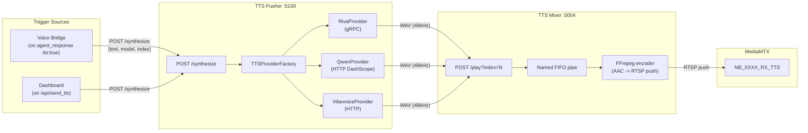

# Speech (TTS Subsystem)

Text-to-speech infrastructure that converts agent text responses into audio streams delivered to the XR glasses. Copied from `ai_stream_pipeline/servers/speech_processing/`.

The TTS **models** (Riva, Qwen, VibeVoice) run as external services. This module handles the last mile: synthesis routing and RTSP audio delivery.

---

## Architecture



---

## TTS Pusher (`tts_pusher/`)

Flask server that receives synthesis requests, routes to the appropriate TTS provider, and pushes the resulting WAV to the TTS Mixer.

### Endpoints

| Method | Path | Description |
|--------|------|-------------|
| POST | `/synthesize` | Synthesize text. Body: `{"text": "...", "model": "riva", "index": 1, "voice": "...", "language": "en"}` |
| GET | `/models` | List available TTS models and voices |

### Provider Abstraction

`TTSProviderFactory` creates the appropriate provider based on the `type` field in `tts_models.yaml`:

| Provider | Type | How it works |
|----------|------|-------------|
| **RivaProvider** | `grpc` | Connects to NVIDIA Riva server (port 50051). Synthesizes PCM, wraps to WAV, normalizes to 48kHz. Requires `nvidia-riva-client` (imported lazily). |
| **QwenProvider** | `http` | Calls DashScope API. Streams base64 PCM chunks, concatenates, creates WAV, normalizes to 48kHz. Requires `dashscope` (imported lazily). |
| **VibeVoice** | `http` | Uses the QwenProvider HTTP path to talk to a VibeVoice server (default port 8050). |

Provider enablement is controlled by the `enabled_env` field in `tts_models.yaml`. If `enabled_env` is set, the corresponding environment variable must be `true`/`1`/`yes`. Models without `enabled_env` are disabled by default.

Providers are configured in `tts_models.yaml` (generated by `configure.py`).

### `tts_models.yaml` format

```yaml
models:
  riva:
    type: grpc
    enabled: false
    host: riva-server
    port: 50051
    voices:
      - name: English-US.Female-1
        language: en
        sample_rate: 48000

  qwen-tts:
    type: http
    enabled: false
    base_url: https://dashscope.aliyuncs.com/api/v1
    api_key_env: DASHSCOPE_API_KEY
    voices:
      - name: loongstella-v1
        language: zh
        sample_rate: 24000

  vibevoice:
    type: http
    enabled: true
    host: tts
    port: 8050
    voices:
      - name: en-Emma_woman
        language: en
        sample_rate: 44100
```

---

## TTS Mixer (`tts_mixer/`)

Maintains persistent RTSP audio streams -- one per camera. When no audio is playing, it writes silence to keep the stream alive. Accepts WAV files via HTTP and injects them into the stream.

### How it works

1. On startup, creates one FFmpeg process per camera:
   ```
   ffmpeg -f s16le -ar 48000 -ac 1 -i pipe:0 -c:a aac -f rtsp rtsp://mediamtx:8554/NB_XXXX_RX_TTS
   ```
2. FFmpeg reads from a named FIFO pipe
3. A writer thread reads from a per-camera queue and writes PCM to the FIFO
4. When the queue is empty, writes silence frames to maintain the stream
5. Keepalive blips every 60 seconds to prevent timeout

### Endpoints

| Method | Path | Description |
|--------|------|-------------|
| POST | `/play?index=N` | Accept WAV body, decode to PCM, enqueue for camera N |
| GET | `/health` | Health check |

---

## How the Voice Bridge Triggers TTS

When the voice bridge receives an `agent_response` with `tts: true` from the NAT server:

1. Voice bridge POSTs to TTS Pusher: `POST http://tts-pusher:5000/synthesize {"text": "...", "model": "vibevoice", "index": <camera_index>}`
2. TTS Pusher synthesizes via the configured provider
3. TTS Pusher POSTs WAV to TTS Mixer: `POST http://tts-mixer:5002/play?index=<camera_index>`
4. TTS Mixer injects audio into the persistent RTSP stream
5. MediaMTX serves the stream at `NB_XXXX_RX_TTS`
6. The gRPC server reads this stream and sends audio to the glasses speaker

---

## Dockerfiles

Both use `python:3.11.14-slim-bookworm` with FFmpeg. Default Debian and PyPI repos (US-based CDN).

- `tts_pusher/Dockerfile` -- also installs `nvidia-riva-client`, `dashscope`, `pyyaml`
- `tts_mixer/Dockerfile` -- minimal: just `flask` and `loguru`
