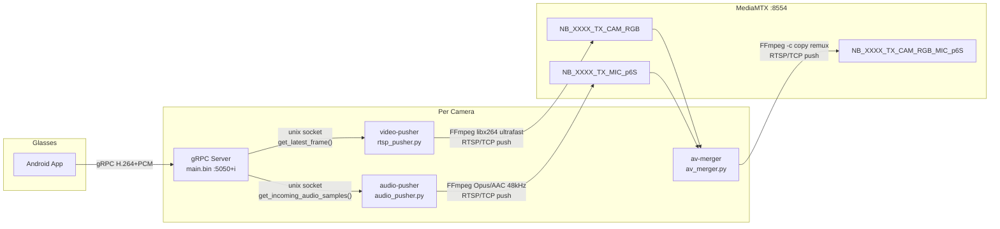

# Streaming

RTSP video and audio pipeline from VITURE XR glasses to MediaMTX. Copied from `ai_stream_pipeline/servers/rtsp_server/` with US-based Dockerfile mirrors.

---

## Pipeline



---

## Stream Path Naming Convention

All RTSP paths follow the pattern: `NB_{XXXX}_{direction}_{type}`

| Component | Meaning |
|-----------|---------|
| `NB` | Prefix (notebook) |
| `XXXX` | 4-digit zero-padded camera index (e.g., `0001`) |
| `TX` | Transmit (from glasses) |
| `RX` | Receive (to glasses) |
| `CAM_RGB` | Video stream |
| `MIC_p6S` | Audio stream (microphone) |
| `CAM_RGB_MIC_p6S` | Merged video + audio |
| `RX_TTS` | TTS audio output (to glasses speaker) |

---

## Components

### `rtsp_pusher.py` (video)

- Connects to XR service via unix socket
- Fetches video frames as numpy arrays via `get_latest_frame()`
- Resizes to 1280x720
- Encodes with FFmpeg (`libx264`, `ultrafast` preset, `zerolatency` tune)
- Pushes to MediaMTX via RTSP/TCP
- Smart frame change detection: pauses FFmpeg when content is stale (>10s)

### `audio_pusher.py` (audio)

- Fetches `AudioSample` objects from XR service
- Auto-detects sample rate from incoming data
- Encodes with FFmpeg (Opus or AAC, resampled to 48kHz)
- Writes silence during gaps to keep encoder clock alive
- Pushes to MediaMTX via RTSP/TCP

### `av_merger.py` (merger)

- Pulls separate video and audio RTSP streams from MediaMTX
- Remuxes into a single stream (`-c copy`, no re-encoding)
- Publishes merged stream back to MediaMTX

### `rtsp_server.py` (GStreamer alternative)

- Alternative to the FFmpeg pusher approach
- Uses GStreamer's `GstRtspServer` with `appsrc`
- Self-contained RTSP server per camera
- Only used in `--gstreamer` mode

---

## MediaMTX Configuration (`mediamtx.yml`)

Base configuration (Modes 1 and 2):
```yaml
paths:
  all:
    source: publisher

api: yes
apiAddress: 0.0.0.0:9997
rtsp: yes
rtspAddress: :8554
hls: yes
hlsAddress: :8888
webrtc: yes
webrtcAddress: :8889
```

When video routing is set to `mediamtx_relay` (Mode 3), `configure.py` generates additional path entries with `runOnReady` hooks:

```yaml
paths:
  "NB_~(\\d+)_TX_CAM_RGB":
    source: publisher
    runOnReady: >
      ffmpeg -i rtsp://localhost:8554/$MTX_PATH
      -c copy -f rtsp rtsp://nat-server:8654/$MTX_PATH
    runOnReadyRestart: yes

  "NB_~(\\d+)_TX_CAM_RGB_MIC_p6S":
    source: publisher
    runOnReady: >
      ffmpeg -i rtsp://localhost:8554/$MTX_PATH
      -c copy -f rtsp rtsp://nat-server:8654/$MTX_PATH
    runOnReadyRestart: yes

  all:
    source: publisher
```

These hooks automatically push streams to the NAT server's MediaMTX when a camera goes live. The ffmpeg process is terminated with SIGINT when the stream stops, and restarted when it resumes (`runOnReadyRestart: yes`).

---

## Dockerfile

Based on `python:3.11.14-slim-bookworm` with GStreamer, FFmpeg, and Poetry. The Dockerfile uses default Debian and PyPI repos (US-based CDN). Builds to image `labos_streaming:latest`.

---

## Environment Variables

| Variable | Default | Description |
|----------|---------|-------------|
| `LOGURU_LEVEL` | `ERROR` | Log verbosity for pusher/merger containers |
| `SOCKET_PATH` | `/tmp/xr_service.sock` | Path to XR service unix socket (inside container) |
