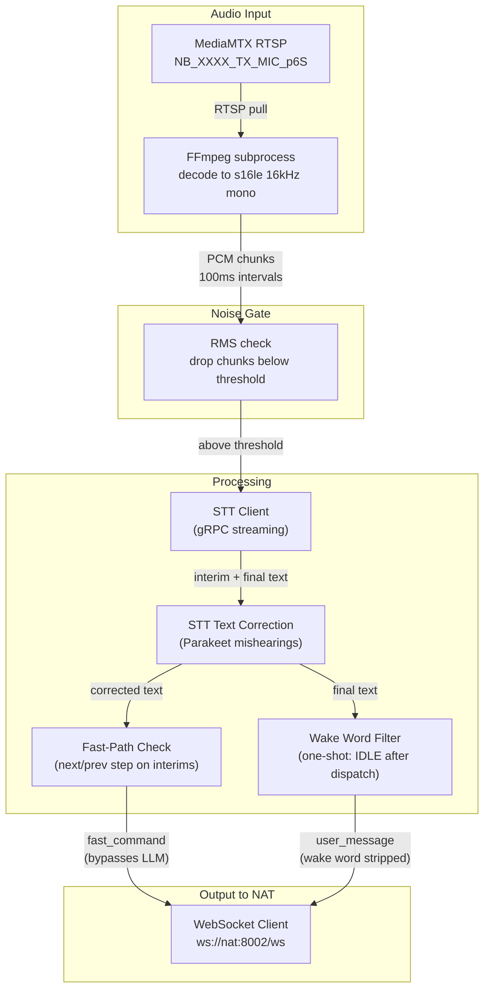
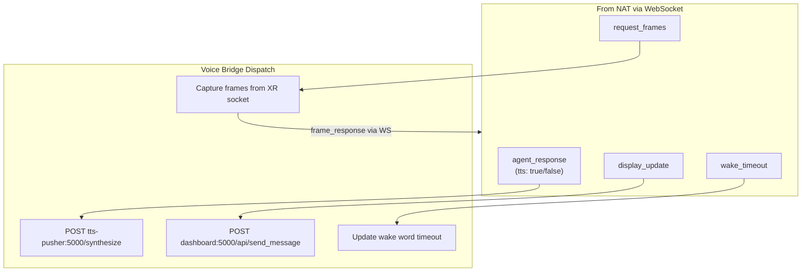
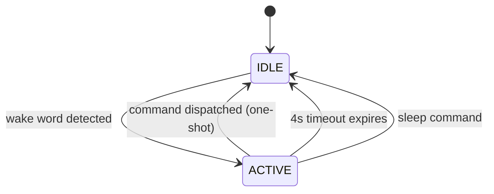
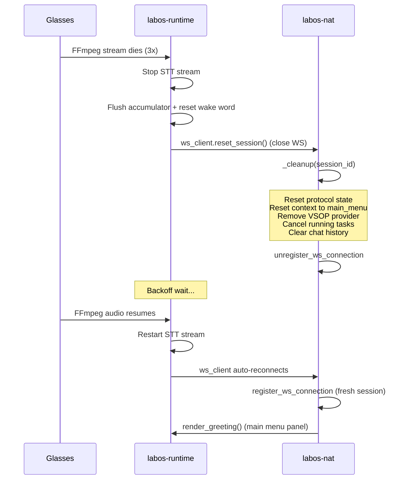

# Voice Bridge

The glue between the XR glasses audio hardware and the agent server. Replaces the old monolithic Pipecat-based `runtime_connector` with a lightweight, focused service (~200 lines per file).

One instance runs per camera. It pulls audio from MediaMTX, transcribes via STT, applies text corrections, filters by wake word, and routes text to the NAT server over WebSocket. On the return path, it dispatches TTS synthesis and XR display updates.

---

## Main Loop



## Return Path



---

## Components

### `bridge.py` -- Main service

Per-camera entry point. Orchestrates:

1. **FFmpeg audio decoder**: Opens RTSP stream from MediaMTX, decodes to raw PCM (16kHz, mono, s16le), pipes to stdout
2. **Noise gate**: Drops PCM chunks with RMS below `STT_NOISE_GATE_RMS` (default: 250) before they reach the STT model
3. **STT streaming**: Chunks PCM at 100ms intervals, sends to configured STT client
4. **STT text correction**: Fixes common Parakeet mishearings of the wake word before any matching
5. **Fast-path commands**: Detects "stella next step" / "stella previous step" on interim transcriptions and sends `fast_command` immediately, bypassing the accumulator and LLM
6. **Interim barge-in**: During TTS playback, checks interim text for the wake word and stops TTS immediately
7. **Wake word gate**: One-shot model -- processes transcription, dispatches command, returns to IDLE
8. **WebSocket send**: Sends `user_message` or `fast_command` to NAT server
9. **WebSocket receive loop**: Dispatches incoming messages to appropriate handlers
10. **Frame capture** (Mode 1): On `request_frames`, captures frames from XR socket, JPEG-encodes, sends back as `frame_response`
11. **Audio forwarding** (optional): When `forward_audio: true`, sends raw PCM chunks to NAT as `audio_stream` messages

### `stt_client.py` -- Pluggable STT

Multiple implementations behind a common interface:

```python
class STTClient(ABC):
    async def start_stream(self) -> None: ...
    async def send_audio(self, pcm_chunk: bytes) -> None: ...
    async def get_transcription(self) -> Optional[str]: ...
    async def stop_stream(self) -> None: ...
```

| Implementation | Config `speech.stt.protocol` | How it works |
|---------------|------------------------------|-------------|
| `GrpcSTTClient` | `grpc` | Streaming gRPC to Riva/NIM Parakeet. Opens a bidirectional stream, sends audio chunks, receives partial and final transcriptions. Supports Riva `EndpointingConfig` for tuning `is_final` latency. |
| `GrpcBatchSTTClient` | `grpc-batch` | Periodic batch recognition for CTC-style engines. |
| `VllmSTTClient` | `vllm` | OpenAI-compatible audio transcription endpoint. |
| `ParakeetWsSTTClient` | `parakeet_ws` | Realtime WebSocket protocol with commit loop. |
| `ElevenLabsSTTClient` | `elevenlabs_realtime` / `elevenlabs` | ElevenLabs Scribe realtime with `pcm_16000`, manual commit cadence, and 500ms speech/silence thresholds. |
| `FailoverSTTClient` | any protocol with `fallback` | Automatic fallback wrapper with `primary_failed`, `fallback_activated`, and `primary_recovered` lifecycle logs. |

Factory: `create_stt_client(config)` reads `speech.stt.protocol` from config.

### `wakeword.py` -- Wake Word Filter (One-Shot)

One-shot state machine: activates on wake word, deactivates immediately after command dispatch or after a short timeout. No persistent session -- every command requires "stella" + command.



| Parameter | Default | Description |
|-----------|---------|-------------|
| Wake words | `["stella", "hey stella"]` | Trigger phrases (case-insensitive) |
| Timeout | 4 seconds | Auto-deactivate if no command follows wake word |
| Sleep commands | `["thanks", "goodbye", "go to sleep"]` | Explicit deactivation phrases |

The filter is a pure function:
```python
def process(self, transcription: str) -> Optional[str]:
    """Returns the cleaned text (wake word stripped) if active, None if filtered out."""
```

### `ws_client.py` -- WebSocket Client

Resilient WebSocket client to the NAT server:

- Connects to `ws://nat-server:8002/ws?session_id=demo-{camera_index}`
- Auto-reconnect with exponential backoff (1s -> 2s -> 4s -> ... -> 30s max)
- Sends `stream_info` on connect (camera RTSP paths)
- Dispatches received messages to registered callbacks:
  - `agent_response` / `notification` -> TTS callback
  - `display_update` -> Display callback
  - `request_frames` -> Frame capture callback
  - `wake_timeout` -> Wake word timer callback

---

## STT Text Corrections

The `_correct_stt_text()` function in `bridge.py` fixes common Parakeet mishearings of "stella" / "hey stella" before any wake word or fast-path matching. Applied to both interim and final transcriptions.

| Parakeet output | Corrected to |
|-----------------|-------------|
| "he's still a" | "hey stella" |
| "hey still a" | "hey stella" |
| "hey still" | "hey stella" |
| "it's still a" | "hey stella" |
| "is still a" | "hey stella" |
| "a star a" | "hey stella" |
| "a star" | "stella" |
| "it's still" | "stella" |
| "is still" | "stella" |

**Guard**: Corrections are skipped if the text contains question indicators (`what`, `how`, `why`, `when`, `where`, `which`, `should`, `are we`, `will`, `can`, `do we`, `?`). This prevents correcting legitimate phrases like "is still working?" into "stella working?".

---

## Fast-Path Commands

Certain commands are detected on **interim** (partial) transcriptions and dispatched immediately as `fast_command` messages, bypassing the accumulator debounce and LLM entirely.

| Command | Regex pattern (case-insensitive) |
|---------|--------------------------------|
| `next_step` | `(?:stella\|hey\s*stella).*(?:next\s*step\|next\|advance\|skip\|move\s*on)` |
| `previous_step` | `(?:stella\|hey\s*stella).*(?:previous\s*step\|prev\s*step\|go\s*back\|previous\|back)` |

A question guard prevents fast-path when the text contains question words (`what`, `when`, `how`, etc.).

Flow:
1. Interim text from STT -> apply `_correct_stt_text()` -> check fast-path regex
2. If match and no question indicators: send `{"type": "fast_command", "command": "next_step"}` to NAT
3. Clear accumulator buffer and STT interim, drain pending finals
4. Deactivate wake word filter (one-shot)

Falls back to checking finals if interims don't trigger.

---

## Disconnect / Reconnect Lifecycle

When glasses disconnect (FFmpeg fails 3 times consecutively), the bridge performs full cleanup and the NAT server resets all session state.



**Runtime cleanup** (on glasses disconnect):
- Stop STT stream
- Flush accumulator buffer
- Reset wake word filter to IDLE
- Cancel any pending TTS
- Reset status to idle/inactive

**NAT cleanup** (on WebSocket disconnect):
- Stop and remove VSOP provider
- Reset protocol state (step, errors, data)
- Reset context manager to `main_menu`
- Cancel running agent tasks
- Clear chat history

**Reconnect** (on glasses audio resume):
- Restart STT stream (fresh gRPC connection)
- WebSocket auto-reconnects (new clean session)
- NAT shows greeting panel

---

## Frame Capture (Mode 1)

When the NAT server needs video frames (for STELLA VLM monitoring), it sends `request_frames` over the WebSocket. The voice bridge handles this because it already mounts the `xr_socket` volume:

1. Receive `{"type": "request_frames", "request_id": "abc", "count": 8, "interval_ms": 1250}`
2. For each of `count` frames:
   - Call `XRServiceConnection.get_latest_frame()`
   - JPEG-encode at configured quality
   - Base64-encode
   - Sleep `interval_ms` between captures
3. Send back `{"type": "frame_response", "request_id": "abc", "frames": [...]}`

This only happens in video Mode 1 (WebSocket). In Modes 2/3, the NAT server reads RTSP directly and never sends `request_frames`.

---

## Environment Variables

| Variable | Required | Description |
|----------|----------|-------------|
| `NAT_SERVER_URL` | yes | WebSocket URL: `ws://nat-server:8002/ws` |
| `CAMERA_INDEX` | yes | 1-based camera index |
| `SESSION_ID` | yes | Session ID for WebSocket (e.g., `demo-1`) |
| `MEDIAMTX_HOST` | yes | MediaMTX hostname (e.g., `mediamtx`) |
| `STT_HOST` | yes | STT service hostname |
| `STT_PORT` | yes | STT service port |
| `STT_PROTOCOL` | no | `grpc`, `grpc-batch`, `http`, `vllm`, `parakeet_ws`, `elevenlabs_realtime` (alias: `elevenlabs`) |
| `STT_MODEL` | no | Model ID for the selected STT provider |
| `STT_LANGUAGE` | no | Language code for cloud STT providers (default: `en`) |
| `STT_COMMIT_INTERVAL_S` | no | Manual commit cadence for realtime STT (default: `0.25`) |
| `STT_MIN_SPEECH_DURATION_MS` | no | Minimum speech duration for VAD commit (default: `500`) |
| `STT_MIN_SILENCE_DURATION_MS` | no | Minimum silence duration for VAD commit (default: `500`) |
| `STT_INCLUDE_TIMESTAMPS` | no | Include timestamp events from provider (default: `true`) |
| `STT_FALLBACK_PROTOCOL` | no | Fallback provider protocol when primary fails |
| `STT_FALLBACK_HOST` | no | Fallback provider host |
| `STT_FALLBACK_PORT` | no | Fallback provider port |
| `STT_FALLBACK_MODEL` | no | Fallback provider model |
| `STT_FALLBACK_RECOVER_AFTER_S` | no | Delay before retrying primary provider (default: `30`) |
| `STT_NOISE_CORRECTION_ENABLED` | no | Enable pre-STT RMS noise gate (default: `true`) |
| `STT_NOISE_GATE_RMS` | no | RMS threshold below which chunks are dropped (default: `250`) |
| `STT_NOISE_SUPPRESSION_TERMS` | no | Comma-separated transcript terms to suppress as noise |
| `STT_SPAM_GUARD_WINDOW_S` | no | Dedupe identical utterances within this window (default: `1.0`) |
| `STT_EP_START_HISTORY` | no | Riva endpointing: speech start history in ms (default: `0` = model default) |
| `STT_EP_START_THRESHOLD` | no | Riva endpointing: speech start probability threshold (default: `0.0` = model default) |
| `STT_EP_STOP_HISTORY` | no | Riva endpointing: silence history for is_final in ms (default: `0`). Lower = faster is_final. |
| `STT_EP_STOP_THRESHOLD` | no | Riva endpointing: silence probability threshold (default: `0.0`) |
| `STT_EP_STOP_HISTORY_EOU` | no | Riva endpointing: end-of-utterance silence history in ms (default: `0`) |
| `STT_EP_STOP_THRESHOLD_EOU` | no | Riva endpointing: end-of-utterance silence threshold (default: `0.0`) |
| `TTS_PUSHER_URL` | yes | TTS pusher base URL (e.g., `http://tts-pusher:5000`) |
| `DASHBOARD_URL` | yes | Dashboard base URL (e.g., `http://dashboard:5000`) |
| `SOCKET_PATH` | no | XR socket path (default: `/tmp/xr_service.sock`) |
| `FORWARD_AUDIO` | no | `true` to forward raw audio to NAT (default: `false`) |
| `FORWARD_FRAMES` | no | `true` to push JPEG frames over WebSocket (default: `false`) |
| `FRAME_WIDTH` | no | Frame width for WS push (default: `640`) |
| `FRAME_HEIGHT` | no | Frame height for WS push (default: `480`) |
| `FRAME_FPS` | no | Frame rate for WS push (default: `15`) |
| `RTSP_EXTERNAL_HOST` | no | IP/host for RTSP URLs sent to NAT (auto-detected at configure time) |
| `WAKE_WORDS` | no | Comma-separated wake words (default: `stella,hey stella`) |
| `WAKE_TIMEOUT` | no | Wake word timeout seconds (default: `4`) |
| `RESET_SESSION_ON_DISCONNECT` | no | Reset NAT session on glasses disconnect (default: `true`) |
| `LOGURU_LEVEL` | no | Log level (default: `INFO`) |

---

## NAT WebSocket Protocol Reference

The full protocol is defined in `ws_protocol.py`. All messages are JSON objects with a required `type` field.

**Connection URL**: `ws://<nat-host>:8002/ws?session_id=<id>`

### Runtime -> NAT (inbound to NAT)

**`stream_info`** -- Sent immediately on connect. Provides the RTSP base URL and stream path names so the NAT server can access live audio/video.

```json
{
  "type": "stream_info",
  "camera_index": 1,
  "rtsp_base": "rtsp://100.93.211.91:8554",
  "paths": {
    "video": "NB_0001_TX_CAM_RGB",
    "audio": "NB_0001_TX_MIC_p6S",
    "merged": "NB_0001_TX_CAM_RGB_MIC_p6S"
  }
}
```

To build a full RTSP URL: `{rtsp_base}/{paths.merged}` -> `rtsp://100.93.211.91:8554/NB_0001_TX_CAM_RGB_MIC_p6S`

**`user_message`** -- Transcribed user speech with the wake word stripped. Only sent when the wake word filter is active.

```json
{"type": "user_message", "text": "list some protocols"}
```

**`fast_command`** -- Sent when a fast-path command (next/previous step) is detected on interim or final transcription. Bypasses the LLM and directly invokes the protocol tool on NAT.

```json
{"type": "fast_command", "command": "next_step"}
```

Valid `command` values: `next_step`, `previous_step`.

**`frame_response`** -- Reply to `request_frames`. Contains base64-encoded JPEG frames.

```json
{"type": "frame_response", "request_id": "abc-123", "frames": ["<base64>", ...]}
```

**`audio_stream`** (optional) -- Raw audio chunks when `FORWARD_AUDIO=true`.

```json
{"type": "audio_stream", "data": "<base64 PCM>", "sample_rate": 16000, "seq": 42}
```

**`video_stream`** (optional) -- JPEG video frames when `FORWARD_FRAMES=true`.

```json
{"type": "video_stream", "data": "<base64 JPEG>", "width": 640, "height": 480, "seq": 42}
```

**`ping`** -- Keepalive. NAT should reply with `pong`.

### NAT -> Runtime (outbound from NAT)

**`agent_response`** -- Agent reply text. When `tts` is `true`, the runtime speaks it through the glasses.

```json
{"type": "agent_response", "text": "Here are three protocols...", "tts": true}
```

**`notification`** -- System notification. When `tts` is `true`, spoken aloud.

```json
{"type": "notification", "text": "Connection established", "tts": true}
```

**`display_update`** -- Push content to the glasses display panels.

```json
{
  "type": "display_update",
  "message_type": "COMPONENTS_STATUS",
  "payload": "{\"Voice_Assistant\": \"listening\", \"Server_Connection\": \"active\"}"
}
```

Valid `message_type` values: `GENERIC`, `SINGLE_STEP_PANEL_CONTENT`, `COMPONENTS_STATUS`.

**`request_frames`** -- Ask the runtime to capture camera frames and send back a `frame_response`.

```json
{"type": "request_frames", "request_id": "abc-123", "count": 8, "interval_ms": 1250}
```

**`tts_only`** -- Speak text without displaying it on the glasses.

```json
{"type": "tts_only", "text": "Processing your request", "priority": "normal"}
```

**`tool_call`** -- Notify the runtime about tool/function call activity. Displayed on the glasses as a GENERIC message with source "Tool".

```json
{"type": "tool_call", "tool_name": "search_protocols", "summary": "Searching for PCR protocols", "status": "started"}
```

Valid `status` values: `started`, `completed`, `failed`.

**`wake_timeout`** -- Override the wake word auto-deactivation timer.

```json
{"type": "wake_timeout", "seconds": 30}
```

**`pong`** -- Keepalive reply to `ping`.

### Robot Runtime Messages

These messages are exchanged between the robot-runtime client and the NAT server. The robot-runtime connects as a separate WebSocket client alongside the voice bridge.

**`robot_register`** (robot -> NAT) -- Sent on connect. Declares available tools so the NAT agent can call them.

```json
{
  "type": "robot_register",
  "session_id": "robot-1",
  "tools": [
    {
      "name": "start_protocol",
      "description": "Start a protocol by name.",
      "parameters": {"protocol_name": {"type": "string", "required": true}}
    }
  ]
}
```

**`robot_execute`** (NAT -> robot) -- Invoke a tool on the robot.

```json
{
  "type": "robot_execute",
  "request_id": "uuid-1234",
  "tool_name": "start_protocol",
  "arguments": {"protocol_name": "vortexing"}
}
```

**`robot_result`** (robot -> NAT) -- Result of a tool execution.

```json
{
  "type": "robot_result",
  "request_id": "uuid-1234",
  "tool_name": "start_protocol",
  "success": true,
  "result": "Started protocol 'vortexing'."
}
```

Available robot tools: `get_status`, `start_protocol`, `get_protocols`, `describe_protocol`, `stop_robot`, `get_object_definitions`, `list_objects`, `move_to_object`, `gripper`, `z_level`, `is_holding_something`, `go_home`, `see_object`, `manual_mode`. See `robot/robot_runtime.py` for full parameter definitions.

### RTSP Stream Access

The preferred way for the NAT server to consume video/audio is via RTSP. On WebSocket connect:

1. Receive the `stream_info` message
2. Build full RTSP URL: `{rtsp_base}/{paths.merged}` (e.g. `rtsp://100.93.211.91:8554/NB_0001_TX_CAM_RGB_MIC_p6S`)
3. Open with any RTSP client (OpenCV, ffmpeg, GStreamer)
4. Individual video-only (`paths.video`) and audio-only (`paths.audio`) streams are also available

The `rtsp_base` host is auto-detected at configure time to be reachable from the NAT server's network (Tailscale-aware).

---

## LabOS Live Session (QR Code Scanning + RTSP Relay)

When `INITIAL_QR_CODE=true`, the bridge starts in QR scanning mode instead of the normal greeting.

### Architecture

```
┌──────────────────────────────────────────────────────────────────────┐
│  XR Glasses                                                         │
│  ┌──────────┐            ┌────────────────────┐                     │
│  │  Camera   │────video──▸│  gRPC Server       │                    │
│  │  (RGB)    │   frames   │  (per-camera)      │                    │
│  └──────────┘            └────────┬───────────┘                     │
│  ┌──────────┐                     │                                  │
│  │  Display  │◂──────────────┐    │  get_latest_frame()             │
│  │  (AR)     │  send_message │    │                                  │
│  └──────────┘               │    ▼                                  │
└─────────────────────────────┼────────────────────────────────────────┘
                              │
┌─────────────────────────────┼────────────────────────────────────────┐
│  Voice Bridge               │                                        │
│                             │                                        │
│  ┌──────────────────────────┴───────────────────────────┐           │
│  │  _qr_scan_task  (async, ~2 FPS)                      │           │
│  │                                                       │           │
│  │  1. Fetch frame from XR connection                    │           │
│  │  2. Decode QR with pyzbar (or cv2 fallback)           │           │
│  │  3. Log ALL decoded payloads                          │           │
│  │  4. Parse JSON and match type == "labos_live"         │           │
│  │  5. Send display update directly to glasses           │           │
│  │     (camera preview + "Point at the QR code" text)    │           │
│  │     (or text-only "Waiting for camera..." if no frame)│           │
│  └──────────────────────────┬───────────────────────────┘           │
│                             │                                        │
│                             │ on match: ws_client.send(qr_payload)   │
│                             ▼                                        │
│  ┌───────────────────────────────────────────────────────┐           │
│  │  WebSocket to NAT Server                              │           │
│  │  {"type": "qr_payload", "payload": {QR JSON}}         │           │
│  └──────────────────────────┬───────────────────────────┘           │
└─────────────────────────────┼────────────────────────────────────────┘
                              │
                              ▼
┌─────────────────────────────────────────────────────────────────────┐
│  NAT Server                                                         │
│                                                                      │
│  Receives qr_payload ──▸ connects to LabOS Live server               │
│                     ◂── responds with session_connected              │
│                          {publish_rtsp: "rtsp://...", session_id: …} │
└──────────────────────────────────────────────────────────────────────┘
                              │
                              ▼
┌─────────────────────────────────────────────────────────────────────┐
│  Voice Bridge: _handle_session_connected                            │
│                                                                      │
│  1. stop_qr_scanning()  -- stop the scan task                        │
│  2. Start FFmpeg RTSP relay:                                         │
│     ffmpeg -i rtsp://mediamtx:8554/{local} -c copy -f rtsp {remote} │
│                                                                      │
│  On session_cleared:                                                 │
│  1. Stop RTSP relay                                                  │
│  2. Restart QR scanning (if INITIAL_QR_CODE is true)                 │
└──────────────────────────────────────────────────────────────────────┘
```

### QR Code Payload Format

The QR code must encode a JSON string. Example:

```json
{"type": "labos_live", "session_id": "abc-123", "server": "wss://live.labos.io"}
```

**Required field:** `"type": "labos_live"` -- the bridge matches on this to distinguish LabOS QR codes from arbitrary ones.

If the scanned QR contains a non-JSON raw string, it is wrapped as `{"type": "labos_live", "raw": "<string>"}` and forwarded to NAT.

### QR Scanning Flow (detailed)

1. `_qr_scan_task` starts as an async task at bridge startup
2. Every 0.5s, it fetches the latest camera frame via `_get_xr_connection().get_latest_frame()`
3. If no frame is available (glasses not connected or camera not streaming), a text-only panel ("Point at the QR code on screen" / "Waiting for camera...") is sent directly to the glasses via `_send_to_glasses()`
4. When a frame is available:
   - The frame is resized to max 480px for faster processing
   - **pyzbar** (`pyzbar.pyzbar.decode` with `ZBarSymbol.QRCODE`) decodes all QR codes in the frame
   - If pyzbar is unavailable, falls back to `cv2.QRCodeDetector.detectAndDecodeMulti()`
   - **Every decoded payload is logged** (`[QR] Decoded payload: ...`) for debugging
5. The decoded string is parsed as JSON:
   - If valid JSON with `type == "labos_live"`: match found, send `qr_payload` to NAT
   - If valid JSON but different type: logged and skipped (`[QR] Ignoring QR -- type=...`)
   - If not valid JSON: treated as a raw string, wrapped, and forwarded
6. On match, scanning stops (`_qr_scanning_active = False`)
7. NAT processes the payload and responds with `session_connected`

### RTSP Relay

When NAT sends `session_connected` with a `publish_rtsp` URL, the bridge starts an FFmpeg process that copies the local MediaMTX stream to the remote RTSP URL:

```
ffmpeg -i rtsp://mediamtx:8554/{local_path} -c copy -f rtsp {publish_rtsp}
```

The relay is stopped on `session_cleared` or disconnect.

### Session Lifecycle Messages

| Message | Direction | Purpose |
|---------|-----------|---------|
| `qr_payload` | Runtime -> NAT | Scanned QR payload forwarded to NAT for processing |
| `session_connected` | NAT -> Runtime | LabOS session confirmed; includes `publish_rtsp` URL |
| `session_cleared` | NAT -> Runtime | Session ended; stop relay, return to QR scanning |

### Environment Variables

| Variable | Default | Description |
|----------|---------|-------------|
| `INITIAL_QR_CODE` | `false` | Enable QR code scanning on startup |
| `GEMINI_AUDIO_FORWARD` | `false` | Forward raw PCM to Gemini Live session |

### Dependencies

QR decoding uses [pyzbar](https://pypi.org/project/pyzbar/) (requires `libzbar0` system library) as the primary decoder, with OpenCV's `QRCodeDetector` as a fallback if pyzbar is not available.

---

## Dockerfile

Based on `python:3.11.14-slim-bookworm` with FFmpeg and libzbar0. Installs `websockets`, `grpcio`, `loguru`, `httpx`, `opencv-python-headless`, `numpy`, `pyzbar`, and the `xr_service_library` wheel.
