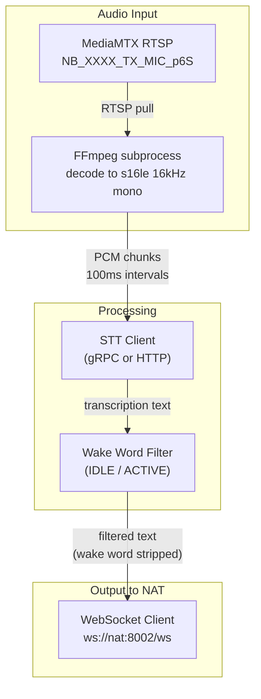
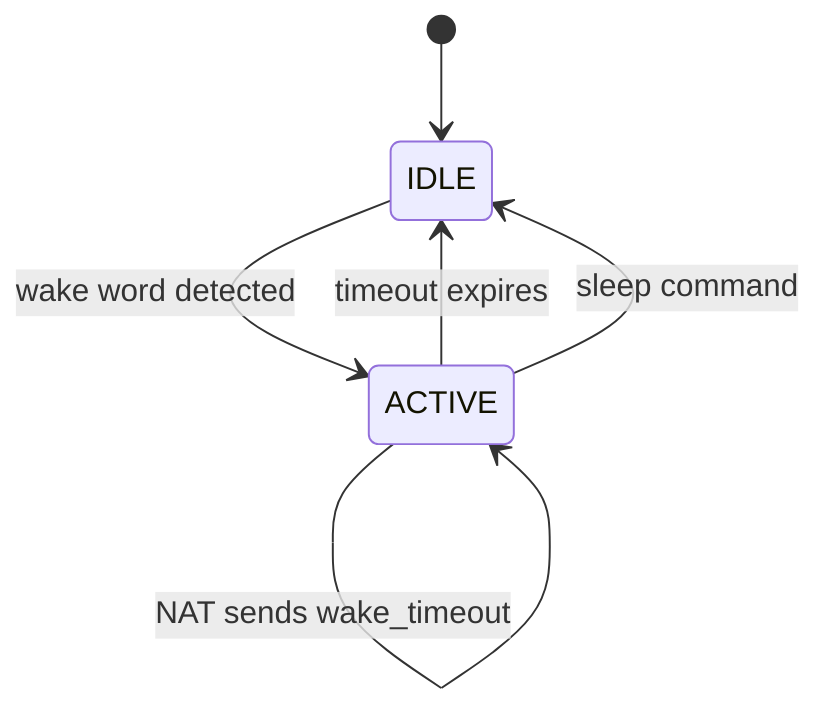

# Voice Bridge

The glue between the XR glasses audio hardware and the agent server. Replaces the old monolithic Pipecat-based `runtime_connector` with a lightweight, focused service (~200 lines per file).

One instance runs per camera. It pulls audio from MediaMTX, transcribes via STT, filters by wake word, and routes text to the NAT server over WebSocket. On the return path, it dispatches TTS synthesis and XR display updates.

---

## Main Loop



## Return Path


---

## Components

### `bridge.py` -- Main service

Per-camera entry point. Orchestrates:

1. **FFmpeg audio decoder**: Opens RTSP stream from MediaMTX, decodes to raw PCM (16kHz, mono, s16le), pipes to stdout
2. **STT streaming**: Chunks PCM at 100ms intervals, sends to configured STT client
3. **Wake word gate**: Passes transcriptions through the wake word filter
4. **WebSocket send**: Sends `user_message` to NAT server
5. **WebSocket receive loop**: Dispatches incoming messages to appropriate handlers
6. **Frame capture** (Mode 1): On `request_frames`, captures frames from XR socket via `XRServiceConnection.get_latest_frame()`, JPEG-encodes, sends back as `frame_response`
7. **Audio forwarding** (optional): When `forward_audio: true`, sends raw PCM chunks to NAT as `audio_stream` messages

### `stt_client.py` -- Pluggable STT

Two implementations behind a common interface:

```python
class STTClient(ABC):
    async def start_stream(self) -> None: ...
    async def send_audio(self, pcm_chunk: bytes) -> None: ...
    async def get_transcription(self) -> Optional[str]: ...
    async def stop_stream(self) -> None: ...
```

| Implementation | Config `speech.stt.protocol` | How it works |
|---------------|------------------------------|-------------|
| `GrpcSTTClient` | `grpc` | Streaming gRPC to Riva/NIM Parakeet. Opens a bidirectional stream, sends audio chunks, receives partial and final transcriptions. |
| `HttpSTTClient` | `http` | POSTs audio chunks to an HTTP endpoint. Simpler but higher latency. |

Factory: `create_stt_client(config)` reads `speech.stt.protocol` from config.

### `wakeword.py` -- Wake Word Filter

Simple state machine extracted and simplified from the old `runtime_connector/filters/wakeword.py`. No Pipecat dependency.



| Parameter | Default | Description |
|-----------|---------|-------------|
| Wake words | `["stella", "hey stella"]` | Trigger phrases (case-insensitive) |
| Timeout | 10 seconds | Auto-deactivate after silence |
| Sleep commands | `["thanks", "goodbye", "go to sleep"]` | Explicit deactivation phrases |

The filter is a pure function:
```python
def process(self, transcription: str) -> Optional[str]:
    """Returns the cleaned text (wake word stripped) if active, None if filtered out."""
```

### `ws_client.py` -- WebSocket Client

Resilient WebSocket client to the NAT server:

- Connects to `ws://nat-server:8002/ws?session_id=demo-{camera_index}`
- Auto-reconnect with exponential backoff (1s -> 2s -> 4s -> ... -> 30s max)
- Sends `stream_info` on connect (camera RTSP paths)
- Dispatches received messages to registered callbacks:
  - `agent_response` / `notification` -> TTS callback
  - `display_update` -> Display callback
  - `request_frames` -> Frame capture callback
  - `wake_timeout` -> Wake word timer callback

---

## Frame Capture (Mode 1)

When the NAT server needs video frames (for STELLA VLM monitoring), it sends `request_frames` over the WebSocket. The voice bridge handles this because it already mounts the `xr_socket` volume:

1. Receive `{"type": "request_frames", "request_id": "abc", "count": 8, "interval_ms": 1250}`
2. For each of `count` frames:
   - Call `XRServiceConnection.get_latest_frame()`
   - JPEG-encode at configured quality
   - Base64-encode
   - Sleep `interval_ms` between captures
3. Send back `{"type": "frame_response", "request_id": "abc", "frames": [...]}`

This only happens in video Mode 1 (WebSocket). In Modes 2/3, the NAT server reads RTSP directly and never sends `request_frames`.

---

## Environment Variables

| Variable | Required | Description |
|----------|----------|-------------|
| `NAT_SERVER_URL` | yes | WebSocket URL: `ws://nat-server:8002/ws` |
| `CAMERA_INDEX` | yes | 1-based camera index |
| `SESSION_ID` | yes | Session ID for WebSocket (e.g., `demo-1`) |
| `MEDIAMTX_HOST` | yes | MediaMTX hostname (e.g., `mediamtx`) |
| `STT_HOST` | yes | STT service hostname |
| `STT_PORT` | yes | STT service port |
| `STT_PROTOCOL` | no | `grpc` (default) or `http` |
| `TTS_PUSHER_URL` | yes | TTS pusher base URL (e.g., `http://tts-pusher:5000`) |
| `DASHBOARD_URL` | yes | Dashboard base URL (e.g., `http://dashboard:5000`) |
| `SOCKET_PATH` | no | XR socket path (default: `/tmp/xr_service.sock`) |
| `FORWARD_AUDIO` | no | `true` to forward raw audio to NAT (default: `false`) |
| `FORWARD_FRAMES` | no | `true` to push JPEG frames over WebSocket (default: `false`) |
| `FRAME_WIDTH` | no | Frame width for WS push (default: `640`) |
| `FRAME_HEIGHT` | no | Frame height for WS push (default: `480`) |
| `FRAME_FPS` | no | Frame rate for WS push (default: `15`) |
| `RTSP_EXTERNAL_HOST` | no | IP/host for RTSP URLs sent to NAT (auto-detected at configure time) |
| `WAKE_WORDS` | no | Comma-separated wake words (default: `stella,hey stella`) |
| `WAKE_TIMEOUT` | no | Wake word timeout seconds (default: `10`) |
| `LOGURU_LEVEL` | no | Log level (default: `INFO`) |

---

## NAT WebSocket Protocol Reference

The full protocol is defined in `ws_protocol.py`. All messages are JSON objects with a required `type` field.

**Connection URL**: `ws://<nat-host>:8002/ws?session_id=<id>`

### Runtime -> NAT (inbound to NAT)

**`stream_info`** -- Sent immediately on connect. Provides the RTSP base URL and stream path names so the NAT server can access live audio/video.

```json
{
  "type": "stream_info",
  "camera_index": 1,
  "rtsp_base": "rtsp://100.93.211.91:8554",
  "paths": {
    "video": "NB_0001_TX_CAM_RGB",
    "audio": "NB_0001_TX_MIC_p6S",
    "merged": "NB_0001_TX_CAM_RGB_MIC_p6S"
  }
}
```

To build a full RTSP URL: `{rtsp_base}/{paths.merged}` -> `rtsp://100.93.211.91:8554/NB_0001_TX_CAM_RGB_MIC_p6S`

**`user_message`** -- Transcribed user speech with the wake word stripped. Only sent when the wake word filter is active.

```json
{"type": "user_message", "text": "list some protocols"}
```

**`frame_response`** -- Reply to `request_frames`. Contains base64-encoded JPEG frames.

```json
{"type": "frame_response", "request_id": "abc-123", "frames": ["<base64>", ...]}
```

**`audio_stream`** (optional) -- Raw audio chunks when `FORWARD_AUDIO=true`.

```json
{"type": "audio_stream", "data": "<base64 PCM>", "sample_rate": 16000, "seq": 42}
```

**`video_stream`** (optional) -- JPEG video frames when `FORWARD_FRAMES=true`.

```json
{"type": "video_stream", "data": "<base64 JPEG>", "width": 640, "height": 480, "seq": 42}
```

**`ping`** -- Keepalive. NAT should reply with `pong`.

### NAT -> Runtime (outbound from NAT)

**`agent_response`** -- Agent reply text. When `tts` is `true`, the runtime speaks it through the glasses.

```json
{"type": "agent_response", "text": "Here are three protocols...", "tts": true}
```

**`notification`** -- System notification. When `tts` is `true`, spoken aloud.

```json
{"type": "notification", "text": "Connection established", "tts": true}
```

**`display_update`** -- Push content to the glasses display panels.

```json
{
  "type": "display_update",
  "message_type": "COMPONENTS_STATUS",
  "payload": "{\"Voice_Assistant\": \"listening\", \"Server_Connection\": \"active\"}"
}
```

Valid `message_type` values: `GENERIC`, `SINGLE_STEP_PANEL_CONTENT`, `COMPONENTS_STATUS`.

**`request_frames`** -- Ask the runtime to capture camera frames and send back a `frame_response`.

```json
{"type": "request_frames", "request_id": "abc-123", "count": 8, "interval_ms": 1250}
```

**`tts_only`** -- Speak text without displaying it on the glasses.

```json
{"type": "tts_only", "text": "Processing your request", "priority": "normal"}
```

**`wake_timeout`** -- Override the wake word auto-deactivation timer.

```json
{"type": "wake_timeout", "seconds": 30}
```

**`pong`** -- Keepalive reply to `ping`.

### RTSP Stream Access

The preferred way for the NAT server to consume video/audio is via RTSP. On WebSocket connect:

1. Receive the `stream_info` message
2. Build full RTSP URL: `{rtsp_base}/{paths.merged}` (e.g. `rtsp://100.93.211.91:8554/NB_0001_TX_CAM_RGB_MIC_p6S`)
3. Open with any RTSP client (OpenCV, ffmpeg, GStreamer)
4. Individual video-only (`paths.video`) and audio-only (`paths.audio`) streams are also available

The `rtsp_base` host is auto-detected at configure time to be reachable from the NAT server's network (Tailscale-aware).

---

## Dockerfile

Based on `python:3.11.14-slim-bookworm` with FFmpeg. Installs `websockets`, `grpcio`, `loguru`, `httpx`, `opencv-python-headless`, `numpy`, and the `xr_service_library` wheel.
